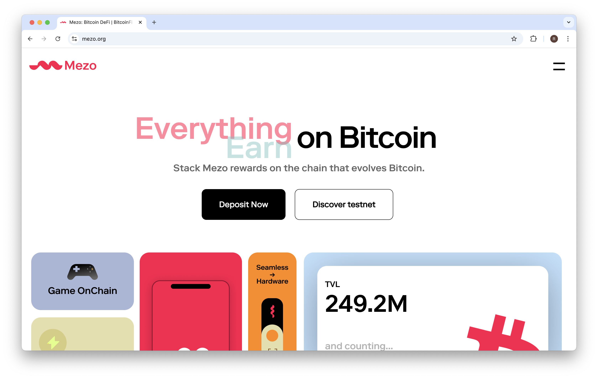
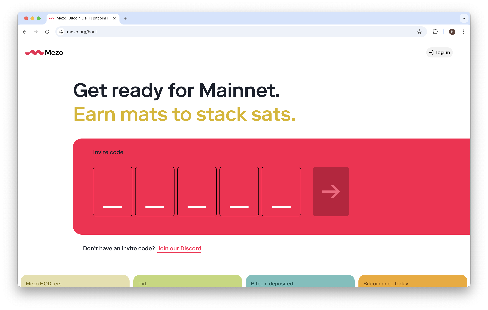
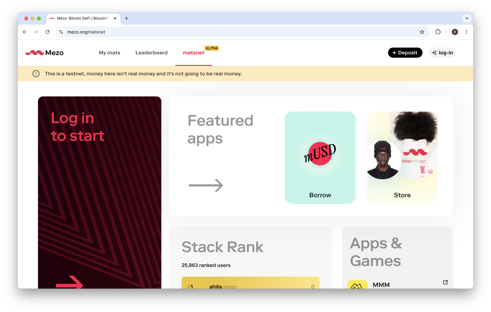
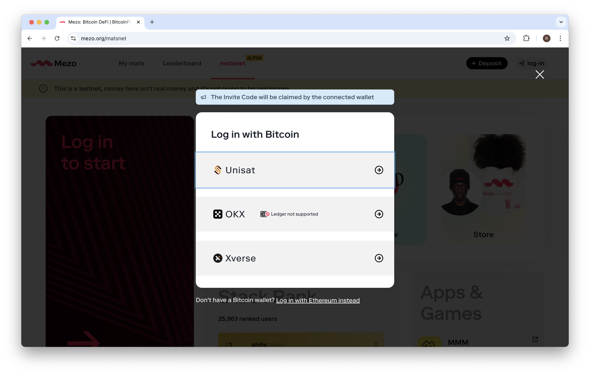
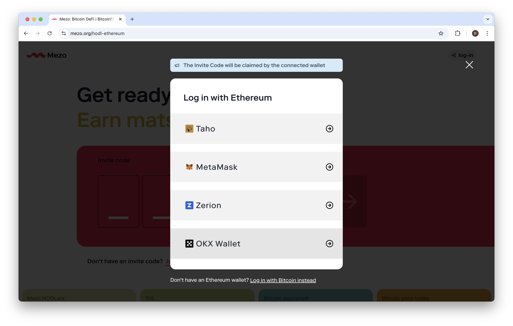
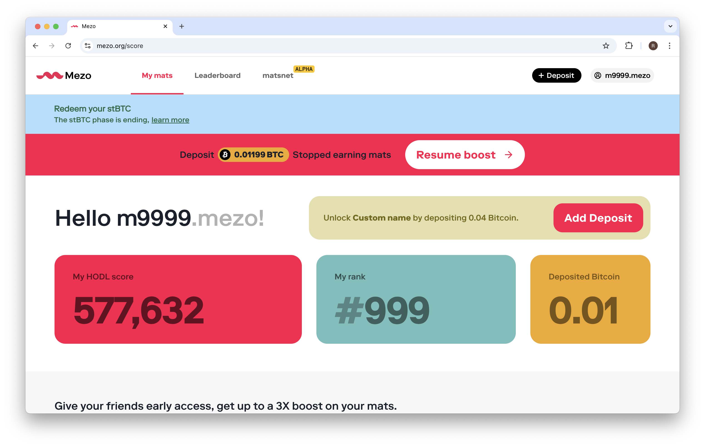
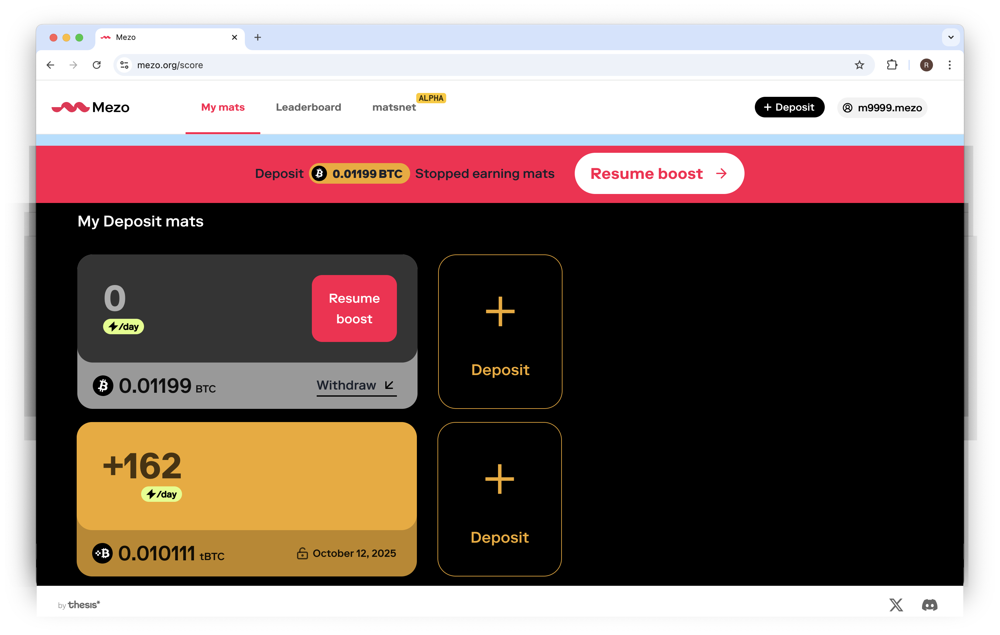
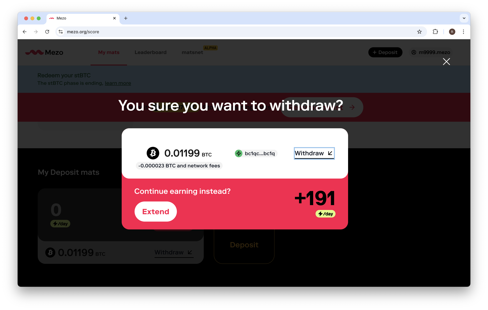
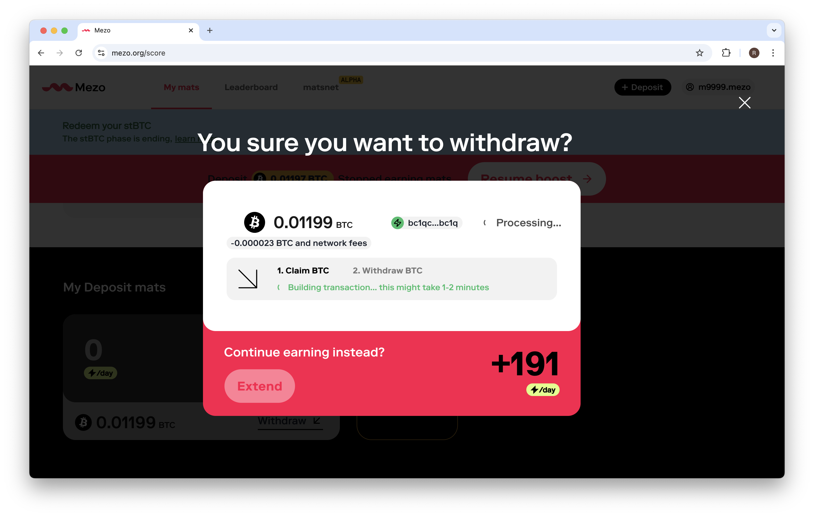
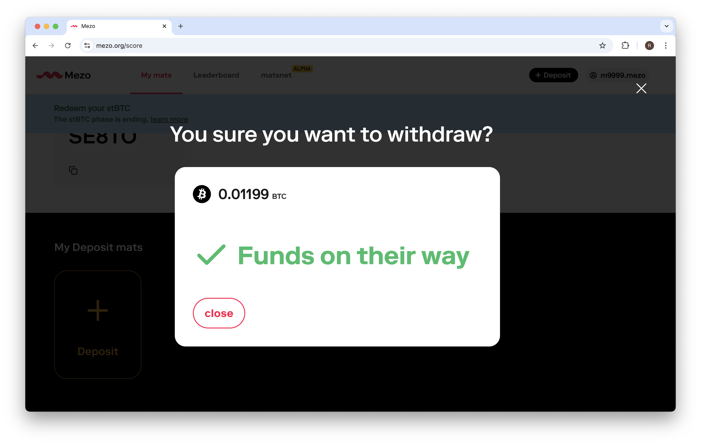

# BTC Withdraw

Bitcoin and other wrapped assets deposited into Mezo will unlock and become available to withdraw after your lock period expires. You may monitor your deposit balances and lock period after you “log-in” using the wallet matching each deposit. 

## Quick steps

- 1. Navigate to the Mezo home page, then click “Deposit Now” (or “Discover testnet”)
- 2. Click “log-in” in the upper right
- 3. Select the wallet used for your deposit (switch between Bitcoin and Ethereum wallets at the bottom of the modal) and sign the login message
- 4. Confirm your Mezo ID in the upper right, then click “My mats”
- 5. Scroll to the bottom to review your remaining lock period, or click “Withdraw”
- 6. Review the confirmation screen, then click “Withdraw” 
- 7. Wait for the transaction to complete (be patient, this will take a minute)
- 8. The confirmation screen will update to confirm your funds are on their way

## Visual guide

- 1. Navigate to the Mezo homepage, then click “Deposit Now” (or “Discover testnet”)

- 2. Click “log-in” in the upper right

- 3. Select the wallet you used for your deposit (switch between Bitcoin and Ethereum wallets at the bottom of the modal) and sign the login message

- 4. Confirm your Mezo ID in the upper right, then click “My mats”

- 5. Scroll to the bottom to review your remaining lock period, or click “Withdraw”

- 6. Review the confirmation screen, then click “Withdraw” 

- 7. Wait for the transaction to complete (be patient, this will take a minute)

- 8. The confirmation screen will update to confirm your funds are on their way

